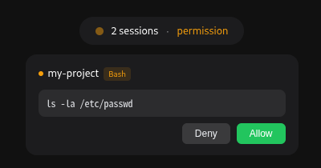
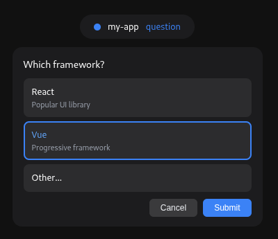

# cc-helper

Claude Code 的桌面伴侣应用——通过系统托盘 + Dynamic Island 风格悬浮窗，实时监控 Claude Code 会话状态，并在桌面端直接处理权限确认与问答交互，无需回到终端。

## 解决的核心痛点

- **权限弹窗打断工作流** — Claude Code 在终端中频繁要求确认权限（执行命令、读写文件等），必须切回终端敲 y/n，严重打断注意力
- **多会话无可见性** — 同时跑多个 Claude Code 实例时，无法一眼看出哪个在跑、哪个等审批、哪个已失败

cc-helper 用一个**屏幕顶部 Dynamic Island 浮窗**同时解决两个问题：聚合显示所有会话状态，权限请求/问题直接在 Island 内弹出操作。

## 特性

- **Dynamic Island** — 屏幕顶部悬浮胶囊，实时显示聚合状态（空闲/工作中/等待权限/出错）
- **权限确认** — Bash/PowerShell 命令、文件读写、WebFetch、Skill 等工具直接在桌面端 Allow/Deny
- **AskUserQuestion** — 多轮问答直接在 Island 内选选项或输入自定义回答
- **多会话管理** — 同时追踪多个 Claude Code 实例，按项目分组显示
- **可拖拽** — Island 位置可自由拖动，自动记忆位置
- **桌面通知** — 任务完成或失败时推送系统通知
- **点击穿透** — 收起状态下 Island 外区域不拦截鼠标，不影响正常操作

## 截图

<p align="center">
  
  
</p>
<p align="center">
  
  
</p>

## 架构

三组件通过 Unix Domain Socket 串联：

| 组件 | 作用 | 语言 |
|------|------|------|
| `cc-helper-hook` | Claude Code Hook → Socket 桥接（~1MB） | Rust |
| `cc-helper` (Tauri daemon) | Island UI + 事件分发 | Rust + Vue 3 |
| `helper-protocol` | 共享序列化协议定义 | Rust |

```
Claude Code ──(hook stdin)──→ cc-helper-hook ──(Unix Socket)──→ cc-helper
                                                                │
                                                       Dynamic Island UI
                                                                │
Claude Code ←─(hook stdout)── cc-helper-hook ←─(socket)────────── 用户操作
```

## 核心数据流

```
① Hook 注册 → ② Claude Code 触发 → ③ cc-helper-hook 桥接 → ④ IPC 分发
→ ⑤ 主循环处理 → ⑥ Island 前端渲染 → ⑦ 用户决策 → ⑧ 回传闭环 → ⑨ Session 清理
```

### 详细步骤

1. **Hook 注册** — 写入 `~/.claude/settings.json`，注册 PermissionRequest/PostToolUse/Notification/Stop/StopFailure/SessionStart/SubagentStop 等事件到 `cc-helper-hook` wrapper 命令

2. **Claude Code 触发 Hook** — 遇到事件时以 JSON stdin 调用 wrapper 进程，wrapper 保存 stdin 到临时文件并转发给 cc-helper-hook，期望 stdout JSON 回应

3. **cc-helper-hook 桥接** — 读 stdin → 构造 `Request`（version + event + session_id + cwd + payload） → 连 Socket `/tmp/cc-helper.sock` → 发送 JSON+newline → 等响应 → 解析输出 stdout（如有 `hookSpecificOutput` 则包装为 Claude Code 期望格式）

4. **IPC 分发**（`ipc.rs`） — 非 `PermissionRequest` 略立即 Ack + 转主循环；`PermissionRequest` 创建 oneshot channel 阻塞等用户决策（Claude Code 在等 stdout 回应）

5. **主循环处理**（`lib.rs`） — 更新 Session 状态 → 聚合状态（优先级：WaitingPermission > Failed > Working > Idle） → emit `island:update-status` → `PermissionRequest` 特殊处理：IslandManager 存储 oneshot Sender + 生成唯一 key → emit `island:show-request`

6. **Island 前端渲染**（`DynamicIsland.vue`） — Island 从 160×36 胶囊展开为面板，根据 toolName 自动选模式：
   - `AskUserQuestion` → "question" 模式（多轮选项 + 自由输入 "Other"）
   - `Bash`/`PowerShell` → "command" 模式（命令文本 + Allow/Deny）
   - `Edit`/`Write`/`Read`/`Glob`/`Grep` → "file" 模式（文件路径 + Allow/Deny）
   - `WebFetch` → "webfetch" 模式（URL + Prompt + Allow/Deny）
   - `Skill` → "skill" 模式（技能名 + 参数 + Allow/Deny）
   - 其他 → "fallback" 模式（原始 JSON + Allow/Deny）

7. **用户决策** — 点击 Allow/Deny 或选答案 → 调 Tauri 命令 `resolve_permission`

8. **回传闭环** — resolve → oneshot Sender 发 `Response` → IPC 写 Socket → cc-helper-hook 解析输出 stdout → Claude Code 读到决策 → 继续执行或拒绝

9. **Session 清理** — 每次处理事件后自动检查，同时有 60 秒周期 staleness 检查应对用户退出场景

## Dynamic Island 状态

| 状态 | 颜色 | 说明 |
|------|------|------|
| Idle | 灰色 | 无活跃会话 |
| Working | 绿色脉冲 | Claude Code 正在工作中 |
| Permission | 黄色脉冲 | 等待用户授权工具执行 |
| Question | 蓝色脉冲 | Claude Code 正在提问 |
| Failed | 红色 | 任务失败 |

点击 Island 查看所有会话详情。权限请求和问题会自动展开 Island 等待操作。

## 点击穿透机制

Island 是一个全屏宽透明窗口（always-on-top, decorations=false, transparent），收起时仅 160×36 胶囊区域捕获鼠标：

- **macOS/Windows** — 40ms 轮询循环检测光标是否在内容区域内，动态切换 `set_ignore_cursor_events`
- **Linux** — 使用 GTK `input_shape_combine_region` API 设置输入区域

展开时全窗口可交互；收起时胶囊外区域点击直接穿透到下层应用。

## 安装

### 前置要求

- [Rust](https://rustup.rs/) (edition 2021+)
- [Node.js](https://nodejs.org/) (v18+)
- [Claude Code CLI](https://docs.anthropic.com/en/docs/claude-code)

### 构建

```bash
npm install

# 开发模式运行
npm run tauri dev

# 构建生产版本（自动嵌入 cc-helper-hook）
npm run tauri build
```

### 注册 Hook

应用已内置 cc-helper-hook（通过 Tauri `externalBin` 嵌入应用包），无需单独安装。两种方式注册：

**方式一：托盘菜单**（推荐）

右键系统托盘图标 → Install Hooks

**方式二：命令行**

```bash
# macOS
"/Applications/cc-helper.app/Contents/MacOS/cc-helper" --install

# Windows
"C:\Program Files\cc-helper\cc-helper.exe" --install
```

卸载同理，改 `--uninstall` 或通过托盘菜单操作。

## 使用

1. 启动 cc-helper 应用
2. 系统托盘出现图标，屏幕顶部出现 Dynamic Island
3. 正常使用 Claude Code — cc-helper 自动监控所有会话

## 项目结构

```
claude-code-helper/
├── src-tauri/                  # Tauri (Rust) 后端
│   └── src/
│       ├── main.rs             # Tauri 入口
│       ├── lib.rs              # 应用逻辑，事件分发主循环，托盘菜单，Tauri 命令
│       ├── ipc.rs              # Unix Socket IPC 监听，Ack/阻塞分发
│       ├── session.rs          # 多会话状态管理，聚合状态计算，staleness 检查，自动清理
│       ├── island.rs           # Dynamic Island 窗口创建/定位/拖拽保存/点击穿透/请求转发
│       ├── dialog.rs           # 独立窗口权限对话框（Island 方式的后备）
│       └── install.rs          # Hook 安装/卸载（操作 ~/.claude/settings.json + wrapper 脚本）
│       └── build.rs            # 构建：将 cc-helper-hook 复制到 binaries/ 目录
├── crates/
│   ├── protocol/               # 共享 IPC 协议定义
│   │   └── src/lib.rs          # HookEvent, Request, Response, wire format
│   └── cc-helper-hook/         # 轻量 CLI hook 桥接（嵌入应用包）
│       └── src/
│           ├── main.rs         # stdin → Request → socket → Response → stdout
│           └── install.rs      # 独立使用时的 hook 安装逻辑
├── src/                        # Vue 3 前端
│   ├── components/
│   │   ├── DynamicIsland.vue   # Island 主组件（胶囊/会话列表/6种权限模式/拖拽/点击穿透）
│   │   ├── PermissionDialog.vue # 独立窗口权限对话框组件
│   │   └── SessionPanel.vue    # 会话面板组件
│   ├── island-main.ts          # Island 窗口初始化 + 获取初始状态
│   ├── dialog-main.ts          # 对话框窗口初始化
│   ├── island.html             # Island 窗口 HTML 入口
│   └── dialog.html             # 对话框窗口 HTML 入口
├── vite.config.ts              # 多入口 Vite 配置（main, island, dialog）
├── package.json
└── src-tauri/tauri.conf.json   # Tauri 配置（无默认窗口, macOSPrivateApi, externalBin）
```

## Wrapper 脚本机制

由于 Claude Code 不使用 shell 执行 hook 命令（直接解析命令字符串，引号被视为字面字符），路径含空格会导致解析失败。安装时自动在 `~/.claude/bin/cc-helper-hook` 创建 wrapper 脚本：

```bash
#!/bin/bash
stdin_file="/tmp/cc-helper-stdin-$.txt"
cat > "$stdin_file"
'/Applications/cc-helper.app/Contents/MacOS/cc-helper-hook' "$@" < "$stdin_file"
rm -f "$stdin_file"
```

wrapper 将 stdin 保存到临时文件后重定向给实际二进制，确保 Claude Code 传入的 hook 事件 JSON 正确到达 cc-helper-hook。

## 支持的 Hook 事件

| 事件 | IPC 行为 | 处理逻辑 |
|------|----------|----------|
| `PermissionRequest` | 阻塞等用户决策 | Island 展开权限对话框，返回 Allow/Deny 或回答 |
| `SessionStart` | 略立即 Ack | 注册新会话（Working 状态） |
| `PostToolUse` | 略立即 Ack | 更新会话为 Working |
| `Notification` | 略立即 Ack | 记录通知 |
| `Stop` | 略立即 Ack | 会话改为 Idle，推送桌面通知 "Task Complete" |
| `StopFailure` | 略立即 Ack | 会话改为 Failed，推送桌面通知 "Task Failed" |
| `SubagentStop` | 略立即 Ack | 更新会话状态 |

## Session 清理策略

每次处理 Hook 事件后自动执行，同时有 60 秒周期 staleness 检查：

- **Staleness 降级** — Working/WaitingPermission 状态超过 5 分钟无新事件的会话自动降级为 Idle（应对用户直接退出 Claude Code 的场景）
- **时间清理** — Idle 状态超过 24 小时、Failed 状态超过 1 小时的会话删除
- **数量清理** — 总数超过 50 时删除最旧的会话

## 技术栈

- **后端**: Rust + Tauri 2 + Tokio
- **前端**: Vue 3 + TypeScript + Vite
- **通信**: Unix Domain Socket + JSON-line 协议（版本号校验）
- **通知**: tauri-plugin-notification（NSUserNotification / libnotify / Windows Toast）

## License

MIT